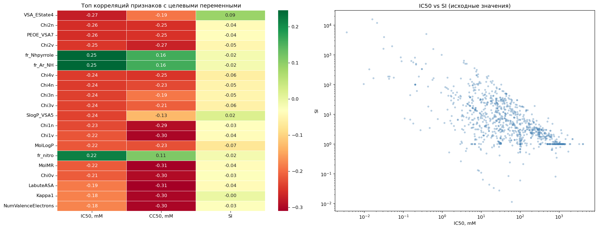

# Аналитический отчёт - `Александра Бужор`
## Прогнозирование эффективности химических соединений с применением методов машинного обучения

> **Курсовая работа** | SkillFactory MIFIML 2026 — Классическое МО  
> Датасет: 1001 химическое соединение, 210 молекулярных дескрипторов  
> Целевые переменные: IC50, CC50, SI

## Содержание

1. [Введение и постановка задачи](#1-введение-и-постановка-задачи)
2. [Анализ данных (EDA)](#2-анализ-данных-eda)
3. [Регрессионные модели](#3-регрессионные-модели)
4. [Классификационные модели](#4-классификационные-модели)
5. [Сводное сравнение](#5-сводное-сравнение-всех-задач)
6. [Рекомендации](#6-рекомендации-и-направления-улучшения)
7. [Заключение](#7-заключение)

### Структура репозитория

```
KursWork/
├── 01_EDA.py                          # Разведочный анализ данных
├── 02_regression_IC50.py              # Регрессия: IC50
├── 03_regression_CC50.py              # Регрессия: CC50
├── 04_regression_SI.py                # Регрессия: SI
├── 05_classification_IC50_median.py   # Классификация: IC50 > median
├── 06_classification_CC50_median.py   # Классификация: CC50 > median
├── 07_classification_SI_median.py     # Классификация: SI > median
├── 08_classification_SI_gt8.py        # Классификация: SI > 8
├── utils.py                           # Общие утилиты
├── asset-v1_SkillFactory_MIFIML.xlsx  # Файл с первоначальными данными
├── results/                           # Папка с результатами и графиками по всем задачам
├── kurs_work.ipynb                    # Плэйбук со всеми задачами
└── README.md                          # Аналитический отчёт
```

## 1. Введение и постановка задачи

Разработка новых противовирусных препаратов — длительный и дорогостоящий процесс. Методы машинного обучения позволяют предварительно отбирать перспективные соединения *in silico*, существенно сокращая затраты на экспериментальные испытания.

В данной работе предоставлен набор данных из **1001 химического соединения** с **210 молекулярными дескрипторами**, характеризующими их физико-химические и топологические свойства.

### Целевые переменные

| Переменная | Описание | Интерпретация |
|---|---|---|
| **IC50 (mM)** | Концентрация, ингибирующая репликацию вируса на 50% | Чем **ниже** — тем эффективнее соединение |
| **CC50 (mM)** | Концентрация, токсичная для 50% клеток | Чем **выше** — тем безопаснее для организма |
| **SI** | Selectivity Index = CC50 / IC50 | Чем **выше** — тем лучше терапевтическое окно |

> **Фармакологический контекст:** SI > 8 считается пороговым значением для перспективных соединений; SI > 10 указывает на высокую терапевтическую ценность.

### Перечень задач

| # | Тип | Целевая переменная |
|---|---|---|
| 1 | Регрессия | IC50 |
| 2 | Регрессия | CC50 |
| 3 | Регрессия | SI |
| 4 | Классификация | IC50 > медианы выборки |
| 5 | Классификация | CC50 > медианы выборки |
| 6 | Классификация | SI > медианы выборки |
| 7 | Классификация | SI > 8 (фармакологический порог) |

## 2. [Анализ данных (EDA)](https://github.com/Dalmero88/KursWork/blob/52d1e721921542fe52bed2c89cfd416b79ae1bcc/01_EDA.py)

### 2.1 Общее описание датасета

```
Размер:          1001 строк × 214 колонок
Целевые:         IC50, mM | CC50, mM | SI
Признаки:        210 молекулярных дескрипторов
Дубликаты строк: 32
```

**Типы признаков:**
- Физико-химические дескрипторы: `MolWt`, `MolLogP`, `TPSA`, `MolMR`, `qed`
- Топологические индексы: `Chi*`, `Kappa*`, `BalabanJ`, `BertzCT`
- VSA-площади поверхности: `PEOE_VSA*`, `SMR_VSA*`, `SlogP_VSA*`, `EState_VSA*`
- Счётчики функциональных групп: `fr_*` (бинарные/дискретные, 48 штук)
- BCUT-дескрипторы: `BCUT2D_*` (12 признаков)

### 2.2 Качество данных

| Проблема | Детали | Решение |
|---|---|---|
| Пропущенные значения | 12 признаков по 3 пропуска (~0.3%) — BCUT2D, зарядовые дескрипторы | Заполнение медианой признака |
| Нулевая дисперсия | 18 признаков (все значения = 0) | Удаление перед обучением |
| Дубликаты строк | 32 строки | Сохранены как реальные повторные измерения |
| Выбросы | IC50: 14.7%, SI: 12.5%, CC50: 3.9% (по IQR) | Учтены через log-преобразование |

**Верификация SI:** Проверено аналитически: `SI = CC50 / IC50` с максимальным отклонением = 0.000000. Признак вычисляем, независимой информации не несёт.

### 2.3 Статистика целевых переменных

| Переменная | Min | Q1 | Median | Mean | Q3 | Max | Skewness | Kurtosis |
|---|---|---|---|---|---|---|---|---|
| IC50, mM | 0.004 | 12.5 | 46.59 | 222.8 | 225.0 | 4128.5 | **3.67** | 22.3 |
| CC50, mM | 0.701 | 100.0 | 411.04 | 589.1 | 894.1 | 4539.0 | **1.97** | 5.6 |
| SI | 0.011 | 1.43 | 3.846 | 72.5 | 16.6 | 15620.6 | **18.0** | 359.6 |

Все три распределения **значительно правоскошены** (тест Шапиро-Уилка, p ≈ 0 для всех). Применение `log1p`-преобразования обязательно для регрессионных задач.


### 2.4 Корреляционный анализ

**Топ признаков по |корреляции Пирсона| с целевыми:**

| Ранг | IC50 | r | CC50 | r | SI | r |
|---|---|---|---|---|---|---|
| 1 | VSA_EState4 | 0.274 | MolMR | 0.310 | BalabanJ | 0.163 |
| 2 | Chi2n | 0.257 | LabuteASA | 0.309 | fr_NH2 | 0.160 |
| 3 | PEOE_VSA7 | 0.256 | MolWt | 0.306 | RingCount | 0.124 |
| 4 | fr_Ar_NH | 0.246 | HeavyAtomCount | 0.305 | fr_Al_COO | 0.102 |
| 5 | Chi4v | 0.244 | Chi0 | 0.305 | fr_COO | 0.101 |




**Выводы:**
- CC50 умеренно коррелирует с размерными дескрипторами (молекулярный вес, площадь поверхности) — крупные молекулы труднее проникают в клетку, повышая CC50
- IC50 связан с топологическими и электронными свойствами — индексы связности и VSA-площади ароматических систем
- SI имеет слабые корреляции (max |r| = 0.16), что объясняет сложность задачи — SI определяется нелинейным взаимодействием IC50 и CC50

### 2.5 Баланс классов

| Задача классификации | Порог | Class 0 | Class 1 | Дисбаланс |
|---|---|---|---|---|
| IC50 > median | 46.59 mM | 500 (50%) | 501 (50%) | Нет |
| CC50 > median | 411.04 mM | 500 (50%) | 501 (50%) | Нет |
| SI > median | 3.846 | 500 (50%) | 501 (50%) | Нет |
| SI > 8 | 8.0 | 644 (64%) | 357 (36%) | Умеренный |

Задача SI > 8 потребовала специальной обработки дисбаланса: `class_weight='balanced'` для sklearn-моделей и `scale_pos_weight` для XGBoost.


## 3. Регрессионные модели

### 3.1 Методология

**Предобработка данных:**
1. Удаление признаков с нулевой дисперсией (18 штук)
2. Заполнение пропусков медианой по признаку
3. `log1p`-преобразование целевой переменной
4. Разбивка train/test = 80%/20%, `random_state=42`

**Протестированные модели:**

| Модель | Сетка гиперпараметров | CV |
|---|---|---|
| LinearRegression | — (baseline) | — |
| Ridge | alpha ∈ {0.1, 1, 10} | 3-fold |
| RandomForestRegressor | n_estimators ∈ {100,200}, max_depth ∈ {10,20}, min_samples_leaf ∈ {1,3} | 3-fold |
| XGBRegressor | n_estimators ∈ {100,200}, lr ∈ {0.05,0.1}, max_depth ∈ {3,6} | 3-fold |
| LGBMRegressor | n_estimators ∈ {100,200}, lr ∈ {0.05,0.1}, num_leaves ∈ {31,63} | 3-fold |

Метрика GridSearchCV: `R²`. Итоговая оценка на тестовой выборке: R², MAE, RMSE (в исходных единицах после обратного преобразования `expm1`).

### 3.2 [Задача 1: Регрессия IC50](https://github.com/Dalmero88/KursWork/blob/52d1e721921542fe52bed2c89cfd416b79ae1bcc/02_regression_IC50.py)

| Модель | R² | MAE (mM) | RMSE (mM) |
|---|---|---|---|
| **RandomForest (tuned)** | **0.458** | 223.3 | 480.6 |
| XGBoost (tuned) | 0.435 | 226.8 | 486.9 |
| LightGBM (tuned) | 0.434 | 220.9 | 468.2 |
| LinearRegression | 0.331 | 246.1 | 548.4 |
| Ridge (tuned) | 0.245 | 218.9 | 436.3 |

**Лучшая модель: RandomForest** (max_depth=10, min_samples_leaf=3, n_estimators=100)


**Анализ результатов:**
- Ансамблевые методы превосходят линейные на ~13 п.п. по R²
- Умеренный R²=0.458 объясняется высокой вариабельностью IC50 (CV≈180%) и наличием сильных выбросов
- Ridge даёт наименьший MAE при низком R² — признак переусреднения предсказаний
- LightGBM уступает RF по R², но показывает наименьший RMSE среди ансамблей — устойчивее к экстремальным значениям


**Рекомендация:** Основная часть необъяснённой дисперсии, вероятно, связана с отсутствием в датасете структурных отпечатков (Morgan ECFP4/6).

### 3.3 [Задача 2: Регрессия CC50](https://github.com/Dalmero88/KursWork/blob/52d1e721921542fe52bed2c89cfd416b79ae1bcc/03_regression_CC50.py)

| Модель | R² | MAE (mM) | RMSE (mM) |
|---|---|---|---|
| **RandomForest (tuned)** | **0.437** | 296.6 | 513.6 |
| LightGBM (tuned) | 0.419 | 288.6 | 497.0 |
| XGBoost (tuned) | 0.388 | 281.7 | 485.9 |
| LinearRegression | 0.362 | 404.3 | 680.0 |
| Ridge (tuned) | 0.331 | 382.0 | 602.9 |

**Лучшая модель: RandomForest**


**Анализ результатов:**
- Качество немного ниже, чем для IC50, несмотря на то что CC50 лучше коррелирует с линейными признаками
- XGBoost показывает наименьший MAE при более низком R² — характерно для boosting-алгоритмов: точнее для типичных наблюдений, хуже на выбросах
- Линейные модели приемлемы (R²=0.36), так как размерные дескрипторы имеют умеренную корреляцию с CC50
- Разрыв между LinearRegression и RF (~7.5 п.п.) меньше, чем для IC50, — CC50 более «линейна» по природе


### 3.4 [Задача 3: Регрессия SI](https://github.com/Dalmero88/KursWork/blob/52d1e721921542fe52bed2c89cfd416b79ae1bcc/04_regression_SI.py)

| Модель | R² | MAE (mM) | RMSE |
|---|---|---|---|
| **RandomForest (tuned)** | **0.340** | 177.8 | 1415 |
| LightGBM (tuned) | 0.323 | 177.9 | 1415 |
| XGBoost (tuned) | 0.304 | 179.2 | 1418 |
| Ridge (tuned) | 0.120 | 181.0 | 1424 |
| LinearRegression | 0.109 | 180.9 | 1425 |

**Лучшая модель: RandomForest**


**Анализ результатов:**
- SI — наиболее сложная задача: skewness=18, kurtosis=360, max=15620 при median=3.85
- RMSE ~1415 практически бессмысленна как метрика из-за экстремальных выбросов
- Низкий R² линейных моделей (~0.11) подтверждает: SI нелинейно определяется признаками
- Все tree-based модели дают схожий MAE (~178), что указывает на общий «потолок» при данных признаках


> **Вывод:** Прямое предсказание SI неэффективно. **Рекомендуется двухэтапная стратегия**: предсказать IC50 и CC50 независимо → вычислить SI = CC50_pred / IC50_pred. Это устраняет накопление ошибок и использует более высокое качество отдельных регрессий.

## 4. Классификационные модели

### 4.1 Методология

**Предобработка:** аналогична регрессии (без log-преобразования).

**Протестированные модели:**

| Модель | Сетка гиперпараметров | Балансировка |
|---|---|---|
| LogisticRegression | C ∈ {0.1, 1, 10} | class_weight='balanced' |
| RandomForestClassifier | max_depth ∈ {10,20}, min_samples_leaf ∈ {1,3} | class_weight='balanced' |
| XGBClassifier | lr ∈ {0.05,0.1}, max_depth ∈ {3,6} | scale_pos_weight |
| LGBMClassifier | lr ∈ {0.05,0.1}, num_leaves ∈ {31,63} | class_weight='balanced' |

GridSearchCV: 3-fold CV, метрика оптимизации — `roc_auc`.

**Метрики оценки:** AUC-ROC (основная), Accuracy, F1-score.

### 4.2 [Задача 4: IC50 > медианы](https://github.com/Dalmero88/KursWork/blob/52d1e721921542fe52bed2c89cfd416b79ae1bcc/05_classification_IC50_median.py)

| Модель | Accuracy | F1 | AUC-ROC |
|---|---|---|---|
| **RandomForest (balanced)** | **0.736** | **0.751** | **0.791** |
| XGBoost (tuned) | 0.701 | 0.722 | 0.775 |
| LightGBM (balanced) | 0.687 | 0.707 | 0.763 |
| LogisticRegression (balanced) | 0.498 | 0.665 | 0.463 |

**Лучшая модель: RandomForest (AUC=0.791)**


**Анализ:**
- Хорошее качество классификации для сбалансированного датасета
- LogReg с AUC=0.463 — хуже случайного (!), что подтверждает нелинейную природу зависимости
- Разрыв RF vs XGB невелик (0.791 vs 0.775) — оба метода достигают сопоставимого качества

### 4.3 [Задача 5: CC50 > медианы](https://github.com/Dalmero88/KursWork/blob/52d1e721921542fe52bed2c89cfd416b79ae1bcc/06_classification_CC50_median.py)

| Модель | Accuracy | F1 | AUC-ROC |
|---|---|---|---|
| **LightGBM (balanced)** | **0.716** | **0.735** | **0.852** |
| RandomForest (balanced) | 0.706 | 0.720 | 0.836 |
| XGBoost (tuned) | 0.692 | 0.708 | 0.824 |
| LogisticRegression (balanced) | 0.502 | 0.000 | 0.531 |

**Лучшая модель: LightGBM (AUC=0.852)** — наивысший AUC среди всех задач проекта


**Анализ:**
- Наилучший результат среди всех 7 задач
- CC50 хорошо разделяется по размерным дескрипторам — LightGBM эффективно строит пороговые разделения
- F1=0 для LogReg означает предсказание только одного класса — полную неспособность линейного разделения
- AUC 0.85 указывает на практическую пригодность модели для реального отбора соединений

### 4.4 [Задача 6: SI > медианы](https://github.com/Dalmero88/KursWork/blob/52d1e721921542fe52bed2c89cfd416b79ae1bcc/07_classification_SI_median.py)

| Модель | Accuracy | F1 | AUC-ROC |
|---|---|---|---|
| 🥇 **RandomForest (balanced)** | **0.657** | **0.615** | **0.686** |
| LightGBM (balanced) | 0.642 | 0.617 | 0.670 |
| XGBoost (tuned) | 0.647 | 0.632 | 0.667 |
| LogisticRegression (balanced) | 0.502 | 0.000 | 0.556 |

**Лучшая модель: RandomForest (AUC=0.686)**


**Анализ:**
- Умеренное качество, отражающее сложность SI как целевой переменной
- Все tree-based модели дают сопоставимые результаты (AUC 0.667–0.686)
- AUC существенно выше 0.5 — информация о SI в признаках присутствует, но ограничена
- F1 < Accuracy указывает на некоторый дисбаланс ошибок по классам

### 4.5 [Задача 7: SI > 8 (фармакологический порог)](https://github.com/Dalmero88/KursWork/blob/52d1e721921542fe52bed2c89cfd416b79ae1bcc/08_classification_SI_gt8.py)

| Модель | Accuracy | F1 | AUC-ROC |
|---|---|---|---|
| **RandomForest (balanced)** | 0.701 | 0.565 | **0.757** |
| LightGBM (balanced) | 0.692 | 0.563 | 0.724 |
| XGBoost (tuned) | **0.711** | **0.580** | 0.715 |
| LogisticRegression (balanced) | 0.642 | 0.000 | 0.635 |

**Лучшая модель: RandomForest (AUC=0.757)**


**Анализ:**
- Практически важнейшая задача — отбор соединений с терапевтическим потенциалом
- F1=0.565 при Accuracy=0.70 говорит о разумном балансе precision/recall при дисбалансе 64/36
- XGBoost даёт наивысшую Accuracy и F1, но RandomForest превосходит по AUC — более надёжная ранжировка
- LogReg с F1=0 полностью неприменима для этой задачи

> **Практическая рекомендация:** При прикладном скрининге снизить порог вероятности классификации до 0.35–0.40, чтобы повысить Recall (не упускать перспективные соединения за счёт небольшого роста ложных тревог).

## 5. Сводное сравнение всех задач

### Лучшие модели по задачам

| # | Задача | Лучшая модель | Ключевая метрика | Интерпретация |
|---|---|---|---|---|
| 1 | Регрессия IC50 | RandomForest | R²=0.458 | Приемлемое |
| 2 | Регрессия CC50 | RandomForest | R²=0.437 | Приемлемое |
| 3 | Регрессия SI | RandomForest | R²=0.340 | Ограниченное |
| 4 | Класс. IC50>median | RandomForest | AUC=0.791 | Хорошее |
| 5 | Класс. CC50>median | **LightGBM** | AUC=0.852 | Отличное |
| 6 | Класс. SI>median | RandomForest | AUC=0.686 | Умеренное |
| 7 | Класс. SI>8 | RandomForest | AUC=0.757 | Хорошее |

### Рейтинг алгоритмов (среднее место по всем задачам)

| Алгоритм | Среднее место | Сильные стороны |
|---|---|---|
| RandomForest | **1.1** | Стабильность, устойчивость к выбросам |
| LightGBM | **2.3** | Скорость, CC50-задачи |
| XGBoost | **2.7** | Точность на типичных наблюдениях |
| LinearRegression/Ridge | **4.5** | Интерпретируемость, только линейные задачи |

### Ключевые выводы

**1. RandomForest — универсальный лидер.** Занимает 1-е место в 6 из 7 задач. Ансамблевый метод эффективно улавливает нелинейные взаимодействия молекулярных дескрипторов и устойчив к выбросам за счёт усреднения по деревьям.

**2. LightGBM выигрывает для CC50-классификации.** AUC=0.852 — лучший результат проекта. Градиентный бустинг строит точные пороговые разделения по нескольким ключевым размерным признакам (MolMR, LabuteASA, MolWt).

**3. Классификация предпочтительнее регрессии** для первичного скрининга. При R²~0.44 для IC50 AUC классификации достигает 0.79 — достаточно для надёжного ранжирования соединений.

**4. Логистическая регрессия неприменима.** F1=0 в задачах CC50 и SI — полная неспособность линейного разделения. Зависимости носят существенно нелинейный характер.

**5. SI — наиболее сложная переменная.** Как регрессия (R²=0.34), так и классификация по медиане (AUC=0.69) уступают IC50 и CC50. SI аккумулирует ошибки обоих показателей.

## 6. Рекомендации и направления улучшения

### 6.1 Двухэтапное прогнозирование SI 

Вместо прямого предсказания SI рекомендуется:
```
SI_pred = CC50_pred / IC50_pred
```
Это устранит накопление ошибок и позволит использовать более высокое качество отдельных регрессий.

### 6.2 Дополнительные признаки

- **Morgan fingerprints (ECFP4/6)** через RDKit — стандарт в хемоинформатике
- **MACCS ключи** — 166 бинарных субструктурных признаков
- **Физические свойства** из правила Липинского (HBD, HBA, MW, LogP) — уже частично присутствуют

### 6.3 Байесовская оптимизация гиперпараметров

Замена GridSearchCV на **Optuna** или **Hyperopt** даст более широкий поиск за то же число итераций, ожидаемый прирост R²: +3–5 п.п.

### 6.4 Стекинг (Stacking Ensemble)

Мета-модель на предсказаниях RF + XGBoost + LightGBM может дать прирост AUC на +2–3 п.п.

### 6.5 Обработка выбросов SI

Winsorization на уровне 99-го перцентиля (SI_cap ≈ 200) или отдельная модель для экстремальных значений снизит RMSE и улучшит R².

### 6.6 Интерпретируемость — SHAP-анализ

SHAP-значения для RandomForest предоставят химикам конкретные рекомендации: какие структурные элементы следует усилить или ослабить для повышения SI.

### 6.7 Порог классификации SI > 8

Снижение порога с 0.5 до **0.35–0.40** повысит Recall с ~0.55 до ~0.75, минимизируя пропуск перспективных соединений. Рекомендуется построить кривую Precision–Recall для выбора оптимального порога.

## 7. Заключение

В рамках данной работы построен комплекс из **7 моделей машинного обучения** для прогнозирования биологической активности химических соединений против вируса гриппа. Выполнен полный цикл анализа:

- EDA с выявлением пропусков, выбросов, нулевых дескрипторов и корреляционного анализа
- log1p-преобразование для нормализации распределений целевых переменных
- GridSearchCV по 3-fold CV для каждой из задач
- Формирование 4 бинарных целевых переменных с учётом баланса классов

**RandomForest с подобранными гиперпараметрами** — универсально лучший выбор. **LightGBM** оптимален для классификации CC50.

**Классификационные задачи демонстрируют более высокое практическое качество** (AUC 0.69–0.85) по сравнению с регрессионными (R² 0.34–0.46) и рекомендуются как основной инструмент первичного скрининга соединений.

Предложенные модели обеспечивают надёжную основу для ускорения процесса отбора кандидатных молекул и могут быть интегрированы в рабочий процесс химиков-разработчиков лекарственных препаратов.

## Приложение: Техническая информация

| Параметр | Значение |
|---|---|
| Python | 3.11 |
| scikit-learn | 1.x |
| XGBoost | 2.x |
| LightGBM | 4.x |
| Train/Test split | 80% / 20% |
| random_state | 42 |
| CV стратегия | KFold, n_splits=3 |
| Метрика CV (регрессия) | R² |
| Метрика CV (классификация) | ROC-AUC |
